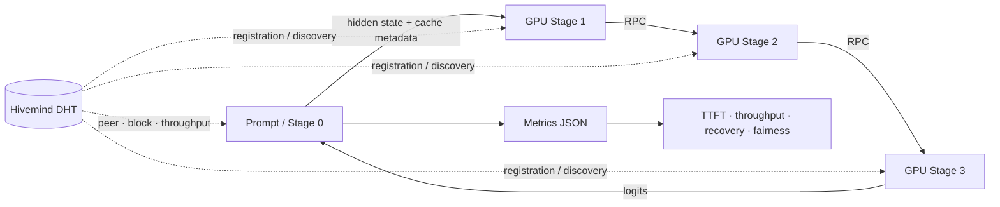

# Mini Petals: 분산 LLM 추론 및 신뢰성 평가

단일 GPU의 메모리 한계를 넘기 위해 LLM 레이어를 여러 GPU 서버에 분할하고, **DHT 기반 탐색·RPC 파이프라인·KV Cache·장애 복구·처리량 기반 부하 분산**을 구현해 성능과 안정성을 함께 평가한 프로젝트입니다.

## 3분 요약

| 구분 | 내용 |
|---|---|
| 문제 | 대규모 모델을 한 GPU에 적재하기 어렵고, 분산 추론 중 한 노드의 지연·이탈이 전체 파이프라인을 중단시킬 수 있음 |
| 접근 | 모델 블록을 stage 단위로 분할하고 Hivemind DHT로 노드를 탐색한 뒤 RPC로 hidden state와 KV Cache를 전달 |
| 신뢰성 | RPC 실패 시 대체 peer를 다시 탐색하고, 저장된 입력을 replay해 해당 decode step을 복구 |
| 부하 분산 | 서버별 compute/network throughput을 DHT에 게시하고 병목이 가장 작은 연속 블록 구간을 선택·재조정 |
| 평가 | TTFT, end-to-end/decode throughput, 복구 지연, 장애 전후 처리량, failover 성공률, 부하 분산 공정성을 JSON으로 기록 |

### 대표 실험 결과

| 환경/지표 | 결과 |
|---|---:|
| 인프라 | Elice Cloud, RTX 5090 × 4 |
| 파이프라인 | 2-stage에서 4-stage로 확장 |
| TTFT (Time to First Token) | 6.46초 |
| 생성 처리량 | 1.56 tokens/s |
| 신뢰성 검증 | 노드 장애 복구 및 부하 분산 동작 확인 |

> 위 수치는 프로젝트 수행 당시의 대표 측정값입니다. 모델·prompt·생성 길이·소프트웨어 버전과 원본 metrics JSON을 함께 고정해야 완전한 재현이 가능합니다. 현재 저장소에는 측정 코드가 포함되어 있으며, 상세 실험 조건과 원본 결과 파일은 보완 과제로 남아 있습니다.

## 문제 정의와 목표

일반적인 단일 노드 추론은 GPU 메모리 용량에 모델 크기가 제한됩니다. 모델을 여러 서버로 나누면 적재 문제는 완화되지만, 네트워크 병목과 peer 장애라는 새로운 문제가 생깁니다. 이 프로젝트의 목표는 다음과 같습니다.

1. 모델 레이어를 여러 GPU 노드에 연속 구간으로 분할해 end-to-end 생성 파이프라인을 구성합니다.
2. 서버 주소를 하드코딩하지 않고 DHT에서 가용 peer와 담당 블록을 찾습니다.
3. 노드 이탈 시 대체 peer로 재라우팅하고 KV Cache를 복구해 생성을 이어갑니다.
4. 처리량 기반 load balancing과 fault tolerance의 효과를 정량 지표로 비교합니다.

## 시스템 구조



- **Stage 0**: tokenizer·embedding·첫 구간을 실행하고, 나머지 블록을 원격 stage로 라우팅한 뒤 최종 logits로 토큰을 생성합니다.
- **Stage 1–3**: 할당된 transformer block만 적재하고 RPC 요청을 처리하며 stage별 KV Cache를 유지합니다.
- **DHT**: peer ID, multi-address, 담당 블록 범위, 처리량 정보를 공유해 동적 탐색과 재배치를 지원합니다.
- **복구 경로**: timeout/연결 실패가 발생하면 실패 peer를 제외하고 대체 peer를 검색한 뒤, 저장한 입력을 replay해 cache 상태를 복구합니다.

## 핵심 설계와 선택 이유

### 1. Pipeline parallelism

모델 전체를 복제하지 않고 연속된 레이어 구간만 각 노드에 적재합니다. tensor parallelism보다 구현과 통신 경계가 명확하고, 서로 다른 서버에 모델 메모리를 분산하기 적합해 선택했습니다.

### 2. Hivemind DHT + RPC

고정 IP 목록 대신 DHT에서 가용 peer를 찾도록 해 노드의 참가·이탈을 동적으로 반영합니다. 실제 tensor 전달은 Hivemind P2P RPC를 사용하고, 요청 metadata에 session/cache 정보를 포함합니다.

### 3. Stage-local KV Cache와 replay

decode 때마다 이전 토큰을 전부 다시 계산하지 않도록 각 stage가 KV Cache를 유지합니다. peer 장애 후에는 대체 peer가 기존 cache를 갖고 있지 않으므로, 클라이언트가 저장한 입력을 replay해 cache를 재구성합니다.

### 4. Throughput-aware load balancing

각 서버의 compute/network 처리량 중 작은 값을 유효 처리량으로 사용합니다. 새 서버는 병목 처리량을 가장 크게 만드는 연속 블록 구간을 선택하고, 실행 중에도 `balance_quality` 임계값에 따라 재배치를 판단합니다. 논문 설정과 현재 기본값의 차이는 [구현 범위 분석](docs/LOAD_BALANCING_IMPLEMENTATION.md)에 기록했습니다.

## 구현 범위

- Llama 계열 모델 레이어 분할 및 stage별 선택 적재
- DHT 기반 peer·담당 블록·처리량 등록과 탐색
- hidden state/logits/KV Cache의 RPC 직렬화 및 전달
- timeout·peer 제외·재탐색·cache replay 기반 장애 복구
- compute/network throughput 기반 블록 선택과 주기적 재조정
- CPU offload와 GPU 상주 레이어 수 설정
- TTFT, end-to-end/decode throughput, recovery latency, failover success rate, load fairness 측정
- fault tolerance 및 load balancing on/off baseline 비교 리포트

## 재현 방법

### 1. 환경

- Linux GPU 서버
- Python 3.8+
- CUDA 사용 가능한 PyTorch 환경
- 주요 의존성: PyTorch 2.0+, Transformers 4.43.x, Hivemind 1.1.11
- 서버 간 DHT/RPC 포트 개방

```bash
git clone https://github.com/jwkim-skku/Python-Based-Distributed-LLM-Inference-and-Reliability-Evaluation.git
cd Python-Based-Distributed-LLM-Inference-and-Reliability-Evaluation
bash scripts/initial_install.sh
source venv/bin/activate
```

### 2. 4-stage 실행

먼저 Stage 1을 실행하고 로그에 출력된 DHT multi-address를 `<BOOTSTRAP_MULTIADDR>`에 넣습니다. 각 명령은 해당 GPU 서버에서 실행합니다.

```bash
# GPU 서버 1: bootstrap + Stage 1
bash scripts/deploy_direct.sh 1 gpt2 "10,20,30" "" <PUBLIC_IP_1> 8002 8003

# GPU 서버 2: Stage 2
bash scripts/deploy_direct.sh 2 gpt2 "10,20,30" "<BOOTSTRAP_MULTIADDR>" <PUBLIC_IP_2> 8004 8005

# GPU 서버 3: Stage 3
bash scripts/deploy_direct.sh 3 gpt2 "10,20,30" "<BOOTSTRAP_MULTIADDR>" <PUBLIC_IP_3> 8006 8007

# GPU 서버 4: Stage 0 client
bash scripts/deploy_direct.sh 0 gpt2 "10,20,30" "<BOOTSTRAP_MULTIADDR>" <PUBLIC_IP_4> 8008 8009 "Hello, how are you?" 32
```

포트 포워딩, Docker, Llama 모델 배포 방법은 [분산 배포 가이드](docs/DEPLOY.md)를 참고하세요.

### 3. 지표 저장과 A/B 비교

Stage 0를 직접 실행하면 결과를 JSON으로 저장할 수 있습니다.

```bash
# Fault tolerance를 끈 baseline
python -m src.main \
  --model gpt2 --splits "10,20,30" --stage 0 \
  --dht_initial_peers "<BOOTSTRAP_MULTIADDR>" \
  --no_fault_tolerance --metrics_json no-ft.json

# Fault tolerance를 켜고 동일 조건과 비교
python -m src.main \
  --model gpt2 --splits "10,20,30" --stage 0 \
  --dht_initial_peers "<BOOTSTRAP_MULTIADDR>" \
  --metrics_json ft.json --baseline_metrics_json no-ft.json
```

`--use_load_balancing`을 각 서버와 Stage 0에 추가하면 block 범위 기반 라우팅을 사용합니다. LB off 결과 JSON을 `--baseline_metrics_json`으로 전달하면 throughput gain과 latency reduction도 계산합니다. 주요 출력 필드는 다음과 같습니다.

- `prefill_time_s`: TTFT로 사용한 prefill 시간
- `end_to_end_tokens_per_s`, `decode_only_tokens_per_s`: 생성 처리량
- `recovery_time_and_latency`: RPC 실패부터 재시도 성공까지의 복구 지연
- `steady_state_and_post_failure_throughput`: 장애 전/복구 후 처리량 비교
- `failover_success_rate`: 반복 실험 중 정상 완료 비율
- `load_distribution_fairness`: peer별 요청 분포와 공정성 지표

장애 주입 절차는 [`scripts/test_fault_tolerance.py`](scripts/test_fault_tolerance.py), load balancing 옵션은 [사용 가이드](docs/LOAD_BALANCING_USAGE.md)에서 확인할 수 있습니다.

## 프로젝트 구조

```text
.
├── src/
│   ├── main.py                    # stage 실행, 생성 루프, 지표 리포트
│   ├── llama_partition.py         # 모델 레이어 분할·선택 적재
│   ├── dht_utils.py               # peer/block/throughput DHT 등록·탐색
│   ├── rpc_handler.py             # 서버 RPC와 KV Cache 관리
│   ├── rpc_transport.py           # client 라우팅·재시도·cache replay
│   ├── load_balancing.py          # 처리량 기반 블록 선택·재조정
│   ├── throughput_measurement.py  # compute/network 처리량 측정
│   └── inference_metrics.py       # 성능·복구·공정성 지표 집계
├── scripts/                       # 설치·배포·장애 주입·운영 스크립트
├── docs/                          # 배포, 네트워크, LB, 트러블슈팅 문서
├── petals/                        # 참조·확장한 Petals 코드
└── requirements.txt
```

## 한계와 다음 단계

- 대표 성능 수치의 model revision, prompt/token length, CUDA·PyTorch 버전, 원본 JSON을 저장소에 함께 고정해야 합니다.
- 장애 주입이 수동/스크립트 기반이므로 반복 가능한 자동 통합 테스트와 CI가 필요합니다.
- 4대의 동종 GPU 환경을 넘어 이기종 GPU·네트워크 지연·동시 사용자 부하에서 검증할 필요가 있습니다.
- 현재 load balancing 기본 재조정 주기와 임계값은 원 논문 설정과 다르므로 동일 조건 A/B 실험이 필요합니다.
- 실제 서비스 적용을 위해 인증, 전송 암호화, 관측성 dashboard, resource quota를 추가해야 합니다.

## 회고

분산 추론에서는 모델을 나누는 것만으로 충분하지 않았습니다. DHT에 게시되는 상태의 최신성, 네트워크 timeout, 장애 후 KV Cache 일관성, 느린 노드가 만드는 pipeline 병목이 성능을 좌우했습니다. 이를 계기로 단순 동작 확인에서 그치지 않고 **TTFT·처리량·복구 지연·장애 전후 성능을 같은 실행 경로에서 기록하는 평가 구조**를 추가했습니다. 다음 실험에서는 환경 manifest와 raw metrics를 함께 버전 관리해 결과의 재현성을 높일 계획입니다.

## 참고 문서

- [분산 GPU 배포](docs/DEPLOY.md)
- [Load Balancing 구현 범위](docs/LOAD_BALANCING_IMPLEMENTATION.md)
- [Load Balancing 사용법](docs/LOAD_BALANCING_USAGE.md)
- [DHT 문제 해결](docs/DHT_TROUBLESHOOTING.md)
- [포트 설정](docs/PORTS.md)

## License

MIT License
